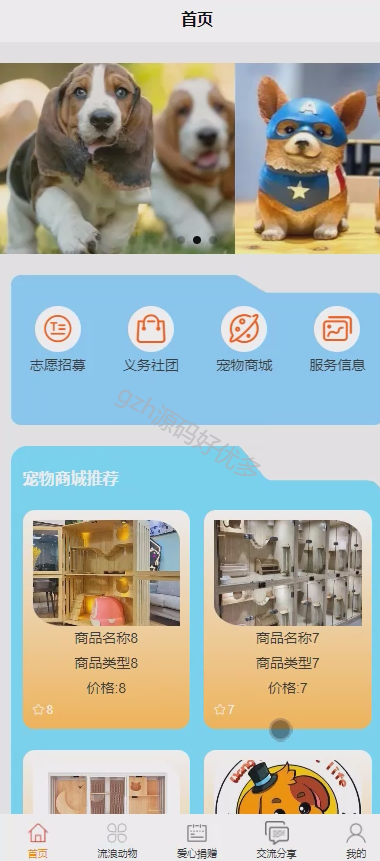

# mpweixinA063
mpweixinA063动物救助领养微信小程序LW
 
## 查看主页获取源码

### 一、作品包含

源码+数据库+设计文档万字+全套环境和工具资源+部署教程

### 二、项目技术

前端技术：Html、Css、Js、Vue2.0、Element-ui、Uniapp

数据库：MySQL

后端技术：Java、Spring Boot、MyBatis

  

### 三、运行环境

开发工具：IDEA/eclipse + HBuilderX + 微信开发者工具

数据库：MySQL5.7（最低要5.7版本）

数据库管理工具：Navicat10以上版本

环境配置软件： JDK1.8+Maven3.6.3

前端Nodejs：14

### 四、项目介绍
项目编号：mpweixinA063

通过“Springboot小动物救助领养小程序”的开发和推广，我们希望能够搭建一个互联网平台，整合小动物救助领养资源，促进信息共享和合作，提高小动物保护工作的效率和效果。同时，我们鼓励公众积极参与，共同关注和支持小动物保护事业，为小动物创造更美好的未来。

用户；用户使用本系统涉到的功能主要有：首页、志愿招募、义务社团、宠物商城、服务信息、流浪动物、爱心捐赠、交流分享、我的等功能

管理员；管理员使用本系统涉到的功能主要有：系统首页、个人中心、用户管理、动物类型管理、品种管理、流浪动物管理、领养申请管理、爱心捐赠管理、捐赠信息管理、志愿招募管理、报名信息管理、义务社团管理、商品类型管理、宠物商城管理、订单信息管理、服务类型管理、服务信息管理、服务预约管理、交流分享、系统管理等功能

### 五、运行截图

  
